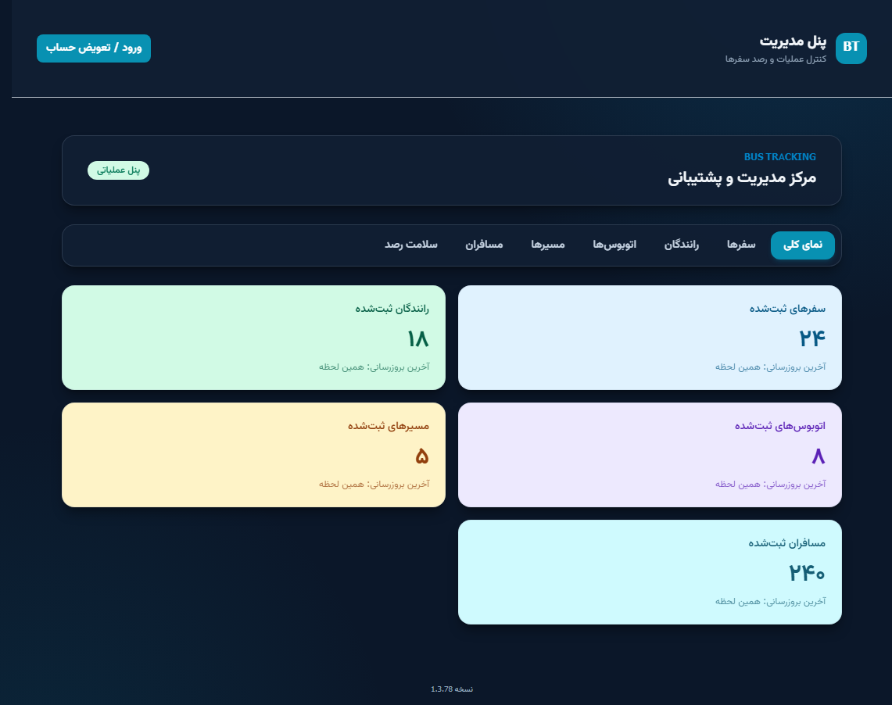
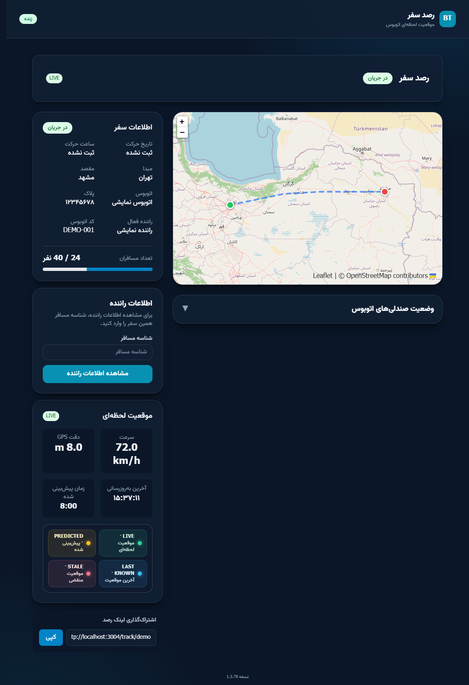

# Bus Tracking System

> Real-time bus tracking platform with a Persian RTL operations portal, driver app, PostgreSQL API, and live passenger tracking.

**Repository description for GitHub:** Real-time bus tracking platform with a Persian RTL admin portal, driver app, PostgreSQL API, and live passenger tracking.

## English

Bus Tracking System is a full-stack monorepo for managing bus routes, vehicles, drivers, passengers, trip assignments, and live passenger-facing trip tracking.

### Screenshots

| Home page — `localhost:3004` | Admin overview |
| --- | --- |
|  |  |

The dashboard image uses sample counters for presentation; it does not contain production or customer data.

| Passenger tracking link |
| --- |
|  |

The passenger screenshot uses the built-in `demo` tracking token and sample trip data.

### Main capabilities

- Admin and support workflows for trips, routes, buses, drivers, passengers, and device health.
- Driver web app and Android wrapper with trip assignment, passenger confirmation, trip lifecycle, and history.
- Shareable passenger tracking links with a live map, trip details, and location freshness indicators.
- Real-time location updates over Socket.IO, with GPS support in the driver app.
- PostgreSQL persistence through Prisma schema and checked-in SQL migrations.
- Shared TypeScript packages for API contracts, validation, domain types, and utilities.
- Persian-first interface with right-to-left layout.

### Applications and ports

| Component | Technology | Local address |
| --- | --- | --- |
| Operations web app | Next.js 14, React 18, Tailwind CSS | http://localhost:3004 |
| REST API and WebSocket gateway | NestJS 10, Prisma, PostgreSQL, Socket.IO | http://localhost:3000/api/v1 |
| Driver app preview | React, Vite, Capacitor | http://localhost:3002 |
| PostgreSQL | PostgreSQL 18 (default local development setup) | `localhost:5432` |

### Technology stack and repository languages

- **Languages detected from source:** TypeScript, JavaScript, Java, SQL, CSS, HTML, and YAML.
- **Frontend:** Next.js, React, Vite, Tailwind CSS, Leaflet.
- **Backend:** Node.js, NestJS, REST, Socket.IO.
- **Database and data access:** PostgreSQL, Prisma ORM, Prisma Migrate.
- **Mobile:** Capacitor 6 and Android/Java.
- **Workspace and dependency management:** pnpm workspaces, Turborepo, Corepack.

GitHub generates the repository language bar automatically from committed source files. It is not a manually configured list; the languages above are the source and configuration formats included in this repository.

### Requirements

- Node.js 20 or newer.
- Corepack, included with supported Node.js releases.
- PostgreSQL 18 for the default Windows development startup configuration. PostgreSQL 15+ may be used when the deployment and schema requirements are configured accordingly.
- Android Studio and Android SDK only when building or running the Android app.

### Install and run

#### Windows

1. Install Node.js 20+ and PostgreSQL.
2. Run [`INSTALL-DEPENDENCIES.bat`](INSTALL-DEPENDENCIES.bat). It installs the locked dependencies for all workspace applications and generates the Prisma client. If `.env` does not exist, it creates it from `.env.example`.
3. Edit `.env`: set `DATABASE_URL` and unique, strong `JWT_SECRET` and `JWT_REFRESH_SECRET` values.
4. Create the PostgreSQL database named in `DATABASE_URL`, then apply the checked-in migrations:

   ```powershell
   cd apps\api
   corepack pnpm exec prisma migrate deploy --schema prisma\schema.prisma
   cd ..\..
   ```

5. Start the API, driver app, and web app from the repository root:

   ```powershell
   corepack pnpm dev
   ```

The development launcher attempts to start PostgreSQL from `C:\Program Files\PostgreSQL\18` on Windows. Set `POSTGRES_ROOT` and, if necessary, `POSTGRES_DATA_DIRECTORY` before starting if PostgreSQL is installed elsewhere. The installer downloads JavaScript workspace dependencies; PostgreSQL and Android Studio are separate system prerequisites.

#### Linux and macOS

```bash
corepack pnpm install --frozen-lockfile
cp .env.example .env
# Configure DATABASE_URL and unique JWT secrets in .env.
cd apps/api
corepack pnpm exec prisma generate --schema prisma/schema.prisma
corepack pnpm exec prisma migrate deploy --schema prisma/schema.prisma
cd ../..
corepack pnpm dev
```

Ensure PostgreSQL is running and the configured database already exists before applying migrations.

### Configuration

- Root `.env.example` lists the API, database, web, and driver environment variables. Never commit a populated `.env` file or production secrets.
- `apps/driver/.env.production.example` documents the `VITE_API_URL` setting used when building the Android production bundle. Copy it to an ignored local `.env.production` and set the public API URL as appropriate.
- The database schema is in `apps/api/prisma/schema.prisma`; schema changes should be accompanied by migrations in `apps/api/prisma/migrations/`.
- Driver profile images are runtime uploads. Configure persistent storage or a persistent volume for `apps/api/uploads/drivers` in deployments; runtime uploads and database contents are not source-controlled.
- Do not put a production database dump, customer data, credentials, signing keys, or private uploads in this repository.

### Useful commands

| Command | Purpose |
| --- | --- |
| `corepack pnpm dev` | Start local development services |
| `corepack pnpm build` | Build all workspace applications |
| `corepack pnpm lint` | Run configured linters |
| `corepack pnpm typecheck` | Run TypeScript checks |
| `corepack pnpm test` | Run workspace unit tests |
| `corepack pnpm test:integration` | Run integration tests |
| `corepack pnpm test:e2e` | Run end-to-end tests |
| `corepack pnpm --filter @bus-tracking/driver build:android` | Build and synchronize the Android project |

The central Windows test runner is `TEST-PROJECT.bat`. It writes generated reports under the ignored `test-results/` directory.

### Repository layout

```text
apps/
  api/       NestJS API, Prisma schema, migrations, and tests
  driver/    React/Vite driver app and Capacitor Android project
  web/       Next.js operations portal and passenger tracking pages
packages/
  api-contracts/  Shared API request/response contracts
  shared-types/   Shared domain types
  shared-utils/   Shared utilities
  validation/     Shared validation schemas
docs/              Architecture and project documentation
infrastructure/    Deployment and infrastructure resources
```

### Deployment notes

- Use a supported Node.js runtime, HTTPS, restrictive CORS, strong JWT secrets, and a managed PostgreSQL database.
- Apply migrations as a deployment step; do not use `prisma db push` against production.
- Persist driver photo uploads outside ephemeral container filesystems and back up the database according to the operator's retention policy.
- Configure production API origins for both the web app and the driver app before building and deploying.
- No open-source license is granted by this repository. Confirm the project owner's distribution terms before redistributing the code.

### Project documentation

- [Versioning and release workflow](docs/VERSIONING.md)
- [Prisma database schema](apps/api/prisma/schema.prisma)
- [Database migration history](apps/api/prisma/migrations/)
- [Shared API contracts](packages/api-contracts/src/index.ts)

---

## فارسی

سامانه رصد اتوبوس یک پروژه یکپارچه برای مدیریت مسیرها، اتوبوس‌ها، رانندگان، مسافران، تخصیص سفر و نمایش زنده موقعیت سفر به مسافر است.

### تصاویر سامانه

| صفحه اصلی — `localhost:3004` | نمای کلی پنل مدیریت |
| --- | --- |
|  |  |

شمارنده‌های تصویر پنل مدیریت صرفاً نمونه هستند و شامل اطلاعات واقعی یا داده‌های مشتریان نمی‌شوند.

| صفحه کامل رصد سفر مسافر |
| --- |
|  |

تصویر مسافر با لینک نمایشی `demo` و اطلاعات نمونه گرفته شده است.

### قابلیت‌های اصلی

- مدیریت سفرها، مسیرها، اتوبوس‌ها، رانندگان، مسافران و سلامت دستگاه‌ها در پنل ادمین و پشتیبانی.
- اپ راننده برای وب و اندروید، شامل سفرهای تخصیص‌یافته، تأیید مسافر، گردش‌کار سفر و تاریخچه.
- لینک اشتراکی مسافر با نقشه زنده، اطلاعات سفر و وضعیت تازگی موقعیت.
- ارسال لحظه‌ای موقعیت با Socket.IO و پشتیبانی GPS در اپ راننده.
- ذخیره اطلاعات در PostgreSQL با Prisma و migrationهای SQL نسخه‌بندی‌شده.
- بسته‌های مشترک TypeScript برای قرارداد API، اعتبارسنجی، انواع دامنه و ابزارهای مشترک.
- رابط فارسی‌محور با چیدمان راست‌به‌چپ.

### برنامه‌ها و نشانی‌ها

| بخش | فناوری | نشانی محلی |
| --- | --- | --- |
| وب پنل عملیات | Next.js 14، React 18، Tailwind CSS | http://localhost:3004 |
| API و درگاه WebSocket | NestJS 10، Prisma، PostgreSQL، Socket.IO | http://localhost:3000/api/v1 |
| پیش‌نمایش اپ راننده | React، Vite، Capacitor | http://localhost:3002 |
| پایگاه داده | PostgreSQL 18 در تنظیم پیش‌فرض توسعه | `localhost:5432` |

### فناوری‌ها و زبان‌های مخزن

- **زبان‌های موجود در سورس:** TypeScript، JavaScript، Java، SQL، CSS، HTML و YAML.
- **رابط کاربری:** Next.js، React، Vite، Tailwind CSS و Leaflet.
- **بک‌اند:** Node.js، NestJS، REST و Socket.IO.
- **پایگاه داده:** PostgreSQL، Prisma ORM و Prisma Migrate.
- **اپ موبایل:** Capacitor 6 و Android/Java.
- **مدیریت workspace و وابستگی‌ها:** pnpm، Turborepo و Corepack.

نوار زبان‌های GitHub به‌صورت خودکار از روی فایل‌های ثبت‌شده در مخزن ساخته می‌شود و فهرست دستی نیست. زبان‌های بالا همان زبان‌ها و قالب‌های تنظیماتی موجود در سورس پروژه هستند.

### پیش‌نیازها

- Node.js نسخه ۲۰ یا جدیدتر.
- Corepack که همراه نسخه‌های پشتیبانی‌شده Node.js ارائه می‌شود.
- PostgreSQL 18 برای تنظیم پیش‌فرض اجرای توسعه در ویندوز. نسخه‌های PostgreSQL 15 به بالا نیز با تنظیم مناسب محیط و سازگاری schema قابل استفاده‌اند.
- Android Studio و Android SDK فقط برای ساخت یا اجرای نسخه اندروید لازم هستند.

### نصب و اجرا

#### ویندوز

۱. Node.js نسخه ۲۰ به بالا و PostgreSQL را نصب کنید.

۲. فایل [`INSTALL-DEPENDENCIES.bat`](INSTALL-DEPENDENCIES.bat) را اجرا کنید. این فایل وابستگی‌های قفل‌شده تمام workspace را نصب و Prisma Client را تولید می‌کند. اگر `.env` وجود نداشته باشد، از روی `.env.example` ساخته می‌شود.

۳. فایل `.env` را ویرایش کنید و `DATABASE_URL`، `JWT_SECRET` و `JWT_REFRESH_SECRET` را با مقادیر امن و منحصربه‌فرد تنظیم کنید.

۴. پایگاه داده‌ای را که در `DATABASE_URL` مشخص شده بسازید و migrationهای ثبت‌شده را اجرا کنید:

   ```powershell
   cd apps\api
   corepack pnpm exec prisma migrate deploy --schema prisma\schema.prisma
   cd ..\..
   ```

۵. از ریشه پروژه سرویس‌ها را اجرا کنید:

   ```powershell
   corepack pnpm dev
   ```

اجراکننده توسعه در ویندوز تلاش می‌کند PostgreSQL را از مسیر `C:\Program Files\PostgreSQL\18` اجرا کند. اگر PostgreSQL در مسیر دیگری نصب است، پیش از اجرا متغیرهای `POSTGRES_ROOT` و در صورت نیاز `POSTGRES_DATA_DIRECTORY` را تنظیم کنید. فایل نصب وابستگی‌ها، بسته‌های JavaScript را دریافت می‌کند؛ PostgreSQL و Android Studio پیش‌نیازهای جداگانه سیستم هستند.

#### لینوکس و macOS

```bash
corepack pnpm install --frozen-lockfile
cp .env.example .env
# مقدارهای DATABASE_URL و کلیدهای امن JWT را در .env تنظیم کنید.
cd apps/api
corepack pnpm exec prisma generate --schema prisma/schema.prisma
corepack pnpm exec prisma migrate deploy --schema prisma/schema.prisma
cd ../..
corepack pnpm dev
```

پیش از اجرای migration، مطمئن شوید PostgreSQL روشن است و پایگاه داده تنظیم‌شده وجود دارد.

### تنظیمات و امنیت داده

- فایل `.env.example` در ریشه، متغیرهای API، پایگاه داده، وب و اپ راننده را مستند می‌کند. فایل `.env` واقعی یا کلیدهای محیط تولید را در Git ثبت نکنید.
- فایل `apps/driver/.env.production.example` متغیر `VITE_API_URL` برای ساخت نسخه اندروید تولید را توضیح می‌دهد. آن را به `.env.production` محلیِ نادیده‌گرفته‌شده کپی کرده و نشانی عمومی API را تنظیم کنید.
- schema پایگاه داده در `apps/api/prisma/schema.prisma` قرار دارد؛ تغییرات schema باید migration متناظر در `apps/api/prisma/migrations/` داشته باشند.
- تصاویر پروفایل رانندگان فایل‌های runtime هستند. در محیط استقرار برای `apps/api/uploads/drivers` فضای پایدار یا volume تنظیم کنید؛ فایل‌های آپلود و داده‌های واقعی پایگاه داده در مخزن قرار نمی‌گیرند.
- dump پایگاه داده تولید، اطلاعات مشتری، رمزها، کلید امضا و تصاویر خصوصی را به مخزن اضافه نکنید.

### فرمان‌های پرکاربرد

| فرمان | کاربرد |
| --- | --- |
| `corepack pnpm dev` | اجرای سرویس‌های توسعه |
| `corepack pnpm build` | ساخت برنامه‌های workspace |
| `corepack pnpm lint` | اجرای linterهای تنظیم‌شده |
| `corepack pnpm typecheck` | بررسی TypeScript |
| `corepack pnpm test` | اجرای تست‌های واحد |
| `corepack pnpm test:integration` | اجرای تست‌های یکپارچه‌سازی |
| `corepack pnpm test:e2e` | اجرای تست‌های انتها‌به‌انتها |
| `corepack pnpm --filter @bus-tracking/driver build:android` | ساخت و همگام‌سازی پروژه اندروید |

اجراکننده مرکزی تست ویندوز `TEST-PROJECT.bat` است و گزارش‌های تولیدشده را در پوشه نادیده‌گرفته‌شده `test-results/` ذخیره می‌کند.

### ساختار پروژه

```text
apps/
  api/       بک‌اند NestJS، schema و migrationهای Prisma و تست‌ها
  driver/    اپ React/Vite راننده و پروژه Capacitor اندروید
  web/       پنل عملیات Next.js و صفحات رصد سفر مسافر
packages/
  api-contracts/  قراردادهای مشترک درخواست و پاسخ API
  shared-types/   انواع مشترک دامنه
  shared-utils/   ابزارهای مشترک
  validation/     schemaهای اعتبارسنجی مشترک
docs/              مستندات معماری و پروژه
infrastructure/    منابع زیرساخت و استقرار
```

### نکات استقرار

- از نسخه پشتیبانی‌شده Node.js، HTTPS، CORS محدود، کلیدهای قوی JWT و پایگاه داده PostgreSQL مدیریت‌شده استفاده کنید.
- migrationها را در مرحله استقرار اجرا کنید؛ در محیط تولید از `prisma db push` استفاده نکنید.
- تصاویر رانندگان را بیرون از فایل‌سیستم موقت کانتینر نگه دارید و مطابق سیاست نگه‌داری، از پایگاه داده پشتیبان تهیه کنید.
- نشانی API تولید را برای وب و اپ راننده پیش از ساخت و انتشار تنظیم کنید.

### مستندات

- [نسخه‌بندی و فرایند انتشار](docs/VERSIONING.md)
- [schema پایگاه داده Prisma](apps/api/prisma/schema.prisma)
- [تاریخچه migrationهای پایگاه داده](apps/api/prisma/migrations/)
- [قراردادهای مشترک API](packages/api-contracts/src/index.ts)

### مجوز

این مخزن مجوز متن‌باز ارائه نمی‌کند. پیش از بازتوزیع کد، شرایط مالک پروژه را بررسی کنید.
